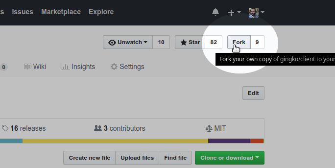
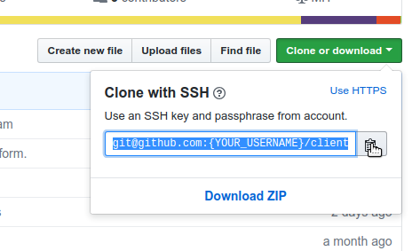

# Contributing

I'd love to get contributions from you, so we can make Gingko better together.

I want to **make it easy for you** to do so, even if you've never contributed to open source before. Here's why this is a priority for me:

1. **I love Teaching**: I enjoy teaching, and want to get better at it. I'll be homeschooling my son, so teaching is going to be an integral part of my life for years to come.

2. **I love Elm**: The language that Gingko is written in, Elm, is fantastic. I want it to grow, and I'd be happy to teach you how to use it. This goes even if you're new to programming.

3. **Teaching Open Source**: I owe a lot to open source collaborations, and I believe it's an important way to move society forward. But if you've never done it before, it can seem intimidating to get started! I know it was for me, not too long ago.

So, if you want to contribute in any way, below are instructions on how to get started. These are all work-in-progress, so if something doesn't work the way you expect, or is *confusing* or *unclear*, it's not you, **it's me**. Let me know if/when you get stuck, so that I can help you out (and improve the instructions accordingly).


## Getting Started
You'll need a free [GitHub Account](https://github.com/join), and the following installed on your computer:

* Git : https://git-scm.com/downloads
* Node : https://nodejs.org/en/
* Elm-Platform : https://guide.elm-lang.org/install.html

The basic process is:

1. Decide what you want to change.
2. Get a copy of the code ("fork then clone the repository").
3. Signal your intentions to me ("make a Pull Request").
4. Start making changes, and uploading them to your online copy.
5. Discuss and get feedback from me.
6. When we're ready, I'll merge your contributions, and make them available to everyone in the next release.


### 1. Defining the Problem
The first thing you'll need, is a clear idea of what you want to change/fix/improve, and why. What bugs you about Gingko, that you'd like to improve?

You can always look through the [list of issues](https://github.com/gingko/client/issues) to see if there's something there you'd like to work on. Some issues are labelled [help wanted](https://github.com/gingko/client/issues?utf8=%E2%9C%93&q=label%3A%22help+wanted%22+is%3Aissue+is%3Aopen), but don't worry even if what you want to do isn't on *any* of the lists.

### 2. Get Your Own Copy
You'll never be making changes *directly* to Gingko's code. First, you get copies of the code, make changes to your own copies, and then ask me to merge those changes in to the official code.

1. First, make an online copy in your own GitHub account, by clicking "Fork" at the top right.



2. Then, get the location of your online (forked) copy...



3. Clone it to your computer:
```bash
git clone git@github.com:{YOUR_USERNAME}/client.git
```
4. Make a new branch to keep your changes separate from the `master` branch:
```bash
git checkout -b name-of-your-feature-or-bugfix
```
5. Run the install script: `npm install`
6. Build the app (and rebuild every time you make a change): `npm start`
7. Try it out: `npm run electron`

### 3. Signal Intentions: Make a Pull Request
Pull requests are a way of saying "I've made some changes, please 'pull' them into the official code." But they're also a way of organizing the conversation around a *proposed* change. That's why I think we should start one early in the process.

Follow the steps here to create one:
https://help.github.com/articles/creating-a-pull-request-from-a-fork/

### 4. Make Changes & Upload Your Work-In-Progress
You're ready to start making your changes and contributions!

For minor features, you can often look through the code to see how something similar was accomplished, and reverse-engineer your own solution. Same goes for fixing small bugs, visual changes, or improving the documentation.

For bigger changes, you'll either have to already know some Elm/JavaScript/HTML/CSS, or be willing to learn. Remember that I'd be glad to help you with this!

Every small, self-contained change should be committed to the work history:
1. `git add` the files you changed
2. `git commit` the changes
3. `git push` those changes to your online forked copy

(If you're new to `git`, see here for how to do the above: [git - the simple guide](http://rogerdudler.github.io/git-guide#trees))

Since you already made a Pull Request, pushing your changes will cause them to show up in the Pull Request as well.

### 5. Discussion & Feedback Loop

... to be added ...

### 6. Incorporate Changes

Once we're both happy with the changes, I'll merge them into the official codebase, and prepare them for release to everyone.

Because I don't want to swamp users with updates, I tend to wait till a few changes have been accumulated before making a release.

And that's it! You're now a contributor :tada:!
