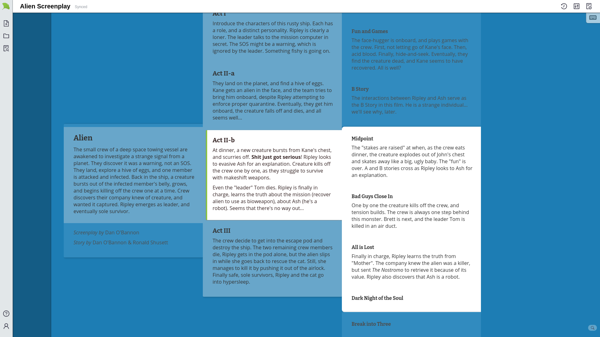

# Gingko Writer [](https://github.com/gingko/client/actions/workflows/web-deploy.yml)

Writing software to help organize and draft complex documents. Anything from novels and screenplays to legal briefs and graduate theses.

This is a ground-up rewrite of [GingkoApp.com](https://gingkoapp.com). The latest version is available online at [gingkowriter.com](https://gingkowriter.com).

This repo contains both halves of the web app:

- `client/` — Elm + JS frontend (bundled with webpack, watched with elm-watch)
- `server/` — TypeScript/Express backend
- `data/` — local database files (created on first run, gitignored)

## Contributions Welcome!

To help **translate Gingko Writer**, join [the translation project](https://poeditor.com/join/project/k8Br3k0JVz).

For code contributions, see [client/CONTRIBUTING.md](./client/CONTRIBUTING.md).

---

## Installation & Dev Environment

### 1. Prerequisites

- [Node.js](https://nodejs.org)
- [Bun](https://bun.sh)
- [SQLite](https://sqlite.org)
- [Redis](https://redis.io) — for server-side sessions
- [CouchDB](https://couchdb.apache.org) — note your admin username and password for step 3 *

\* _This dependency will be removed once all user documents are migrated to SQLite._

Installation of these varies by system, so it's not covered here.

### 2. Clone

```
git clone git@github.com:gingko/client.git gingko
cd gingko
```

### 3. Server

```
cd server
npm i
cp config-example.js config.js
sed -i 's/couchusername/your_couchdb_admin_username/' config.js
sed -i 's/couchpassword/your_couchdb_admin_password/' config.js
npm run build
npm start
```

### 4. Client

In a new terminal:

```
cd client
bun i
cp config-example.js config.js
bun run newwatch
```

Now visit http://localhost:3000 to use your local Gingko Writer install.

## Tests

- Client end-to-end (Playwright): `cd client && bun run test`
- Server unit tests (Jest): `cd server && npm test`
